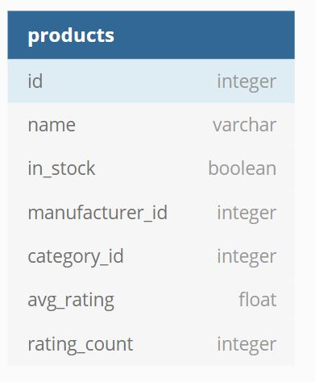

## Product Rating System

### Features 

1. Capture the ratings from the customer and store in a persistent storage

2. Display the ratings on the website next to the product. 
3. Update the ratings for a product

### Assumptions

- **Inventory Service** : This service exists and can be called to fetch all the product details based on product category to be displayed in the UI.

  It provides following API:

  - products(<integer>categoryId, <string>city)  {return all the products with details for that category and city}

  - **updateRatings**( <ObjectArray>ratings ) {updates the ratings of the products}

     `<ObjectArray> ratings = [ { productId, avgRating, ratingCount}, {  productId, avgRating, ratingCount} , ... ]`

   Schema of Products Table:

  

- **Order Service**: This service exists and can be called to create orders, update order details(say status= [ In Process, Delivered, Cancelled]) 

  - This Service also takes care of sending notification to customers to get their ratings for the products they purchased in an order like the mails/notifications we get from amazon/flipkart. 
  - These notifications can be scheduled via a scheduling queue and the notification can be sent say X days after the product is delivered. 

### Design Goals

3. Loosely coupled and **Partition** tolerant : Rating being a non critical component should never impact the components that drive the business operations.  It is ok for the rating service to be down and customer not seeing rating for a product for some time. Other functionalities of the systems should not be directly impacted and should keep functioning when rating service is down.
2. **Availability** : It is a important goal to give customers seamless UX. 
3. Does not require tight **Consistency**. It okay if things are eventually consistent. Its okay if ratings are not displayed/updated immediately when a user submits a rating. In fact its a very common practice to show ratings after few hours/days (yes amazon ratings takes days to reflect!)

### Architecture Diagram

### Architecture key relevant components for Rating Service:

- **Rating Service** : Provides APIs for performing CRUD and aggregations operations of Ratings table. 
- **Redshift Database**: Column based database that supports fast reads and aggregations for calculating average rating. This DB can also be used for other analytics data.
- **Message Queue(Kafka/SQS)**:  Enables you to decouple Rating service and scale it easily. It ensures that ratings are delivered to Inventory service when it is available even if inventory service is down for some time.

### Ratings Table Schema 

### Rating Service APIs 

API Docs can be found here:

https://documenter.getpostman.com/view/2554546/S1Zw9BS7?version=latest#31d55cfb-400c-4636-a472-2d21ec719778

### Process Flow 

**Flow:**

1. **User** views products in ecommerce app => **System ** calls Product Service to fetch Product Details
2. **User** adds items to cart, creates order, makes payment and the order is placed successfully => **System** calls Order Service to create and store order details.
3. **User** Receives Order => **System** update the order details via Order Service, **System Triggers a scheduled event to send notification to customer requesting Rating**

4. **User** clicks on the Mailed Link/Notification to give rating or visits a product page to give rating => **System** does the following:

   - calls **Rating** service API `addRatings`  to store the product ratings in the **ratings table**

   - Rating service periodically(say **X** hours) gets all the product_ids that has new ratings in last **X** hours using the `getRecentRatings` API call.
   - Average ratings for these product_ids is then fetched using `getAvgRating` API call.
   - These ratings are then pushed to the **message queue** that ensures it is delivered to Product Service via `updateRatings` API provided by Product Service

5. **User** may also update the ratings for a product by visiting the product page => **System** Calls Rating service API `addRatings` API to update the  which does a update too!

   

   
